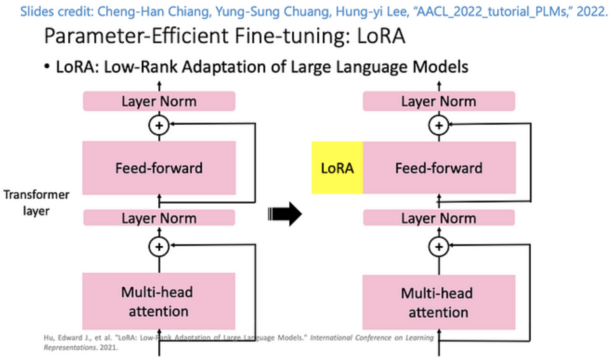
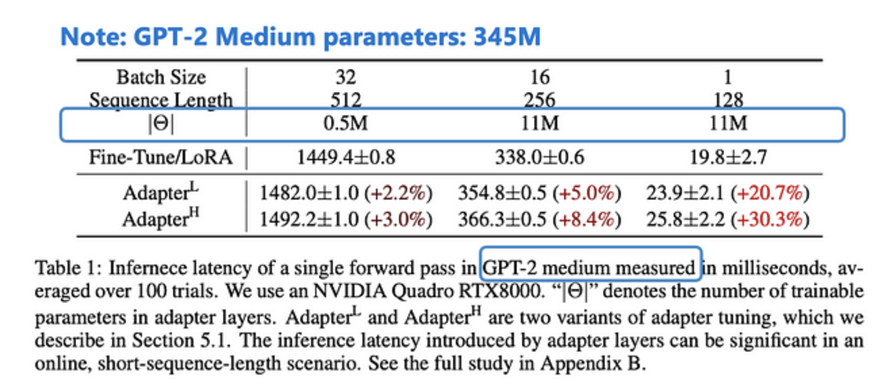
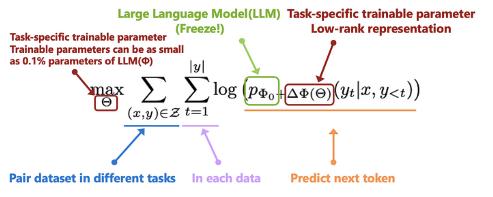

# Lora

## **Introduction**

In recent years, Large Language Models (LLMs), also known as Foundational Models, have been trained using large datasets and models with a massive number of parameters, such as the common GPT-3 (175B parameters). The emergence of ChatGPT also indicates the generalization level of LLMs, as they have performed well in common problems. Here are challenges to solve in Lora:
1. When it comes to specific domains, although in-context learning can be achieved through a few examples (few-shot), fine-tuning the model would yield better results.
2. All dimensions finetuning takes up a lot of memory.

## **Lora Model Architecture**

As models have grown increasingly larger, directly fine-tuning all parameters incurs significant costs. Therefore, in recent years, researchers have focused on efficient fine-tuning, known as Parameter-Efficient Fine-Tuning (PEFT). This article will introduce Low-Rank Adaptation (LoRA) proposed by the Microsoft team, which involves freezing the weights of the pre-trained model (e.g., GPT-3) and fine-tuning it with a small model, achieving excellent fine-tuning results, similar to the Adapter concept. The idea is to use the small LoRA network inserted into specific layers to make the model adaptable to different tasks.

In addition, Cheng-Han Chiang, Yung-Sung Chuang, Hung-yi Lee, “AACL_2022_tutorial_PLMs,” 2022, provides a detailed [explanation](https://d223302.github.io/AACL2022-Pretrain-Language-Model-Tutorial/lecture_material/AACL_2022_tutorial_PLMs.pdf) in the tutorial, as shown in the following figure.

  

In the future, instead of fine-tuning the parameters of a large neural network model, the approach may shift towards training a smaller model or weight, and combining it with the specific layer weights of the original LLM. Compared to fine-tuning the GPT-3 model, this method requires 10,000 times fewer training parameters and only 1/3 of GPU usage. This technique is not only applied to LLMs, but also extensively used in training high-resolution image-generating AIs, such as the Stable-Diffusion generative model.

## **Benefits One: Saving Memory**

The comparison of memory usage between using and not using LoRA technology:

As shown in the figure below, the LoRA model only requires a small number of parameters, with 0.5M and 11M parameters, which is much smaller than the original LLM model (here using GPT-2 Medium with 345M parameters). Moreover, using LoRA technology, the inference efficiency is better than the previous Adapter technology in the case of Batch size = 1.

  

Why is the parameter/size of a model so important? First, it is important to understand how much GPU memory will be used during model training. For details, please refer to Jacob Stern’s comprehensive guide to memory usage in PyTorch.
##### The maximum model usage during training (without considering mixing precision) is calculated as follows: #####
1. Formula: Memory required by the model + Memory required for forward calculation (more flexible) + Memory required for gradients (memory required for model training parameters) + Memory required for optimizer variables * Memory required for model training parameters (usually the largest, Adam can be considered as requiring twice the memory required by the model)
2. The forward calculation depends on the batch size, the size of the input content, and whether or not to use mixing precision. The memory consumption of this part can be reduced by using PyTorch’s checkpoint mechanism, which is flexible and adjustable.
3. The memory required for optimizer variables depends on the different optimizers (SGD: 0, RMSProp: 1, Adam: 2). The common optimizer, Adam, records the EMA and Momentum of the model’s previous gradients, so for Adam optimizer, it will store 2 times the size of the model parameters!
The following is an estimate using the Adam optimizer and no mixing precision (corrections are welcome if there are any errors!):

  

Assuming that the memory consumption of a large model occupies 4 slots, to train the entire model, the Gradient also requires a memory of 4 slots of the model size, and in order to train the model, an optimizer (Adam) is required, which also requires 2 times of memory for the model size, thus occupying 8 slots. This does not yet include the memory required for Forward, which requires 4 times of memory for the model size. It can be imagined that for an extremely large model like GPT-3, with a model size of 175B, the required memory is enormous!!

## **Benefits One: Better Performance** ## 

Method — LoRA(Low-Rank Adaptation)

In the past, make LLM or Foundation Models (such as the GPT series) applicable to various downstream tasks, the goal of training the model (Φ) was to ensure that the model performs well in handling multiple different tasks (Z).

The following figure shows the downstream tasks used for GPT-1, which include common NLP tasks such as classification, hypothesis testing, similarity comparison, and multiple-choice questions. The model is trained by providing different prompts as input.

Radford et al., “Improving Language Understanding by Generative Pre-Training”, in 2018.
In the past, there have been two Parameter-Efficient Fine-Tuning approaches for different downstream tasks:
1. Adapter: By adding a small amount of model architecture and freezing the LLM model parameters, training is performed.
2. Prefixing: Adding tokens to the beginning of the prompt to allow the model to perform better for specific tasks.

The LoRA introduced in this article belongs to the Adapter type. The concept of LoRA is that since LLM is applicable to different tasks, the model will have different neurons/features to handle different tasks. If we can find the features that are suitable for the downstream task from many features and enhance their features, we can achieve better results for specific tasks. Therefore, by combining the LLM model — Φ with another set of trainable parameters Trainable Weight — Θ(Rank decomposition matrices), downstream task results can be optimized.

  

The orange module on the right represents the LoRA model weights that we want to train. By restricting the rank(r) to smaller in the middle, the number of trainable parameters can be significantly reduced, and the dimensionality of the features can be reduced to “r << d”. The overall number of parameters can then be expressed as “|Θ|=2×LoRA ×dmodel ×r”. LoRA is the number of LoRA modules used in the entire model, and in the paper, LoRA modules were inserted into the Attention layer of the Transformer architecture. The value of “r” varies depending on the task, but in experiments, a value of 2~4 has been shown to yield good results. Ultimately, we want to optimize the downstream tasks through the LoRA modules, as shown in the formula below.

  

Wrap Up

  

## **Experiments Evaluation** ##

  

LoRA achieved better results than Fine-tuning, and required much fewer parameters to train.

Compared to other efficient Fine-tuning methods, LoRA achieved the best accuracy.

The experiments only evaluated the performance of adding LoRA modules to the Attention block, and evaluated which block (Q, K, V, or O) achieved the best results while keeping the parameter count fixed.

The choice of the number of Ranks was also investigated.

## **Application Benefits** ##

The Benefits of LoRA are plentiful as we can probably tell. However, some of the most
notable benefits of this approach include the following:
1. A single pretrained model can be shared by several (much smaller) LoRA modules that adapt it to solve different tasks, which simplifies the deployment and hosting process.

2. LoRA modules can be “baked in” to the weights of a pretrained model to avoid extra inference latency, and we can quickly switch between different LoRA modules to solve different tasks.

3. When finetuning an LLM with LoRA, we only have to maintain the optimizer state for a very small number of parameters 10, which significantly reduces memory overhead and allows finetuning to be performed with more modest hardware (i.e., smaller/fewer GPUs with less memory).

4. Finetuning with LoRA is significantly faster than end-to-end finetuning (i.e., roughly 25% faster in the case of GPT-3).

## **Code** ##

  

  

